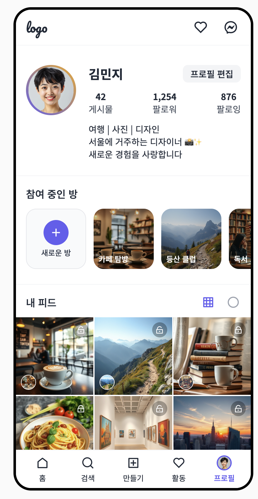
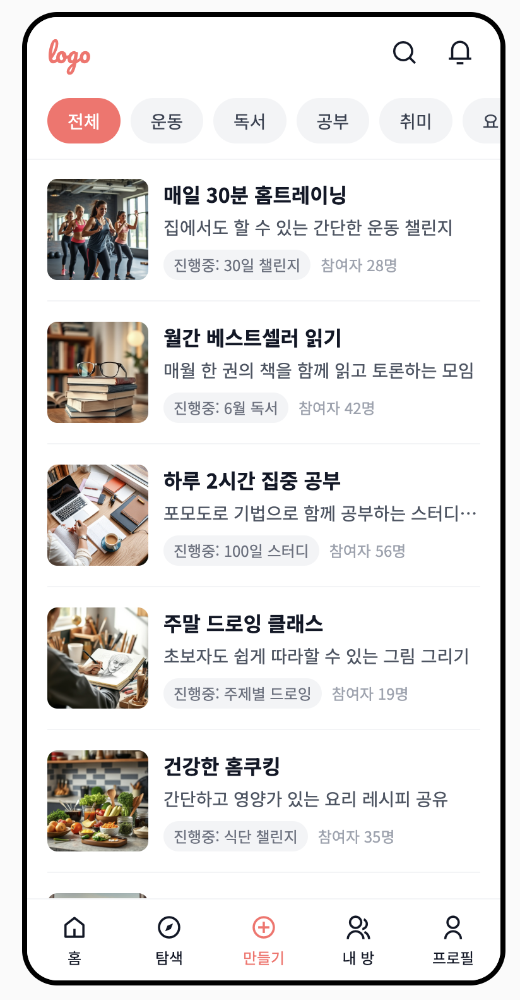
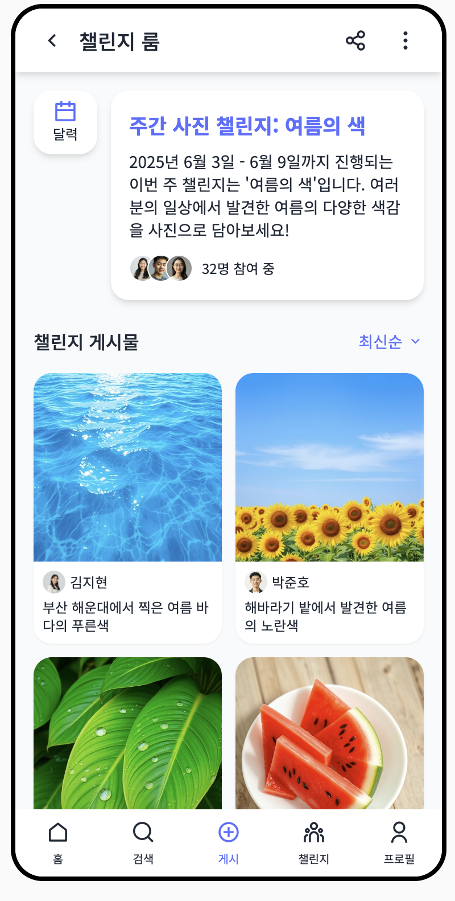
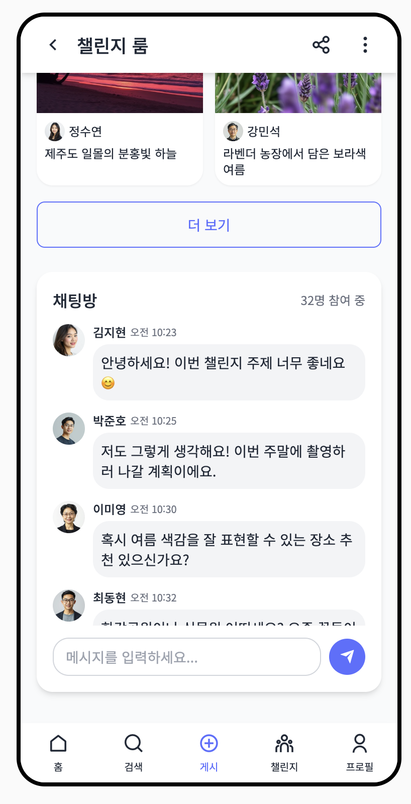
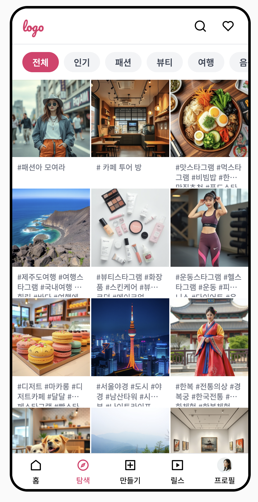

## 배경
- 주 4일제가 되면서 여가시간이 많아져 개인의 취미 생활이 증가 할 것 
- 단순한 여가 활동을 넘어 자기표현, 힐링, 성취감 등을 느끼게 해주는 취미를 하게 될 것. 시간이 있는 사람들에게서 이미 시작됨
	- (개성) 요리, 홈 가드닝 ... ex) 이장우가 5.16 나혼자 산다에서 정육을 배우러 감 
	- (힐링) 캠핑족의 증가 ... 
	- (성취감) 운동 (헬스, 클라이밍) ex) 일반인들도 헬스로 대회를 나가곤 함 
- 취미 생활은 콘텐츠 생산으로 연결될 수 있음. 콘텐츠 생태계가 더욱 풍부해질 것. (모두가 생산자이자 소비자가 될 것) 
- 콘텐츠 생산: 
	- 현재는 대부분의 콘텐츠가 비싼것(혹은 자랑할만한 것) 소비한걸 보여주는 게 대부분 
	- 미래에는 자신의 취미 분야에 전문가가 되어 콘텐츠를 생산하게 될 것 
- 콘텐츠 소비: 
	- 새로운 것들을 소비하고 싶을 것 -> 취미가 증가하고, 모두가 콘텐츠의 생산자가 된 시점에 이를 잘 공유할 수 있는 앱이 필요. 하지만, insta 나 기존의 sns 는 자기표현, 힐링, 성취감을 공유하는 앱이기보다는 자랑을 위한 성격이 강함. 
	-> (1) 개인의 취미 생활을 지원하면서, (2) 이를 공유할 수 있게 하여 자기표현, 성취감을 느끼게 해주는 동시에 (3) 새로운 취미에 대한 호기심도 자극, 새로운 분야의 콘텐츠 생산자로 성장 할 수 있도록 돕는 앱을 만들어보자

## 조사
- 특정 취미에 맞춰진 앱들이 아주 많다. 하지만 새로운 관심 분야를 찾을 수 있도록 특정 취미가 아닌, 서로의 취미를 공유하는 앱이 필요하다.
- 비슷한 앱
	- 레몬 8 (https://designcompass.org/2023/05/03/lemon-8/)
	- noplace (https://brunch.co.kr/@72318dc5edbe435/2)
	- vingle (https://m.onestore.co.kr/ko-kr/apps/appsDetail.omp?prodId=0000412996&scYn=Y)
	- 팔레트 (https://paletteearlybirds.creatorlink.net/#:~:text=)
## 기능
- 필요 요소:
	- 자기 발전: 게임적 요소(레벨, 포상)와 사회적 연결 요소(챌린지, 이벤트)를 접목하면 취미 SNS 사용자들의 내재적 동기를 자극 
		- 특정 취미에 맞춰진 앱들이 이를 어떻게 달성 유도를 하는지 봐야 함
	- 관심 내 분야: 나의 관심사가 쉽게 검색되고(원클릭, 독립된 탭), 그 안에서 특정 취미에 맞춰진 앱들이 가진 기능들 만큼을 잘 제공해야 함
	- 관심 외 분야: 핫한, 재미난, 관심 있을법한 취미들이 피드에 잘 올라와야 함

## 핵심요소 
- 게임적 요소(레벨, 포상)와 사회적 연결 요소(챌린지, 이벤트)를 접목하면 취미 SNS 사용자들의 내재적 동기를 자극할 수 있을 것
- 나의 취미 다이어리를 쓸 수 있게 하고, 이를 public/private 로 공유 타입을 설정할 수 있도록 제공하여 본인의 성장을 기록 및 공유할 수 있는 기능 제공
- 나의 관심 취미와 같은 취미를 가진 다른 유저 기록들이 쉽게 공유/검색되고(원클릭, 독립된 탭), 그 안에서 개인의 성장에 대한 모티베이션을 받을 수 있으면 좋겠음
- 핫한, 재미난, 관심 있을법한 취미들이 공통 피드에 잘 올라와서 지금까지 해보지 않았지만 새로운 취미에 대한 인사이트를 얻거나, 쉽게 시작할 수 있는 기능이 있으면 좋겠음

## 디자인
- 아래는 readdy.ai 로 작업한 이미지들

### 1. 개인 프로필 화면
- 프로필 페이지의 핵심은 참여 중인 방의 리스트!
  - 방에서 피드 작성용 챌린지가 시작되고, 이를 다이어리에 기록하는 방식
- 피드에는 프라이빗 포스트인지 퍼블릭 포스트인지가 나오고, 챌린지를 진행한 방이 아래 작게 나온다

### 2. 챌린지 방 목록
- 카테고리별 챌린지 방 목록
- 본인의 수준에 맞는 방을 찾아 들어가 챌린지를 함께 진행한다

### 3. 챌린지 방 상세
- 챌린지 방에서는 서로가 공통의 챌린지 목표를 가지고 챌린지를 진행하게 된다
- 달력에서 지난 챌린지와 참여자들의 기록을 볼 수 있다
- 아래 채팅 창에서 서로가 아이디어를 공유하고 함께 성장 할 수 있다

### 4. 홈 화면
- 전체 피드가 디폴트고, 카테고리가 섞여서 들어간다
- 이때 각 피드의 대표 이미지 아래는 참여하고 있는 방이 나온다. 이를 통해 내가 들어가 있는 방이 홍보되고, 사람들이 재밌는 챌린지를 하는 방에 참여하게 된다
- 방장은 재밌는 챌린지를 해야 방이 홍보가 되기 때문에 재밌는 챌린지를 운영하게 된다

